# OncoVision: METABRIC Risk Stratifier 🧬


An AI-powered clinical decision support system for breast cancer survival prediction, built on the METABRIC dataset using advanced machine learning techniques.


## 📊 Key Results & Performance

### Model Performance Comparison


*C-index scores across different algorithms*

| Model | C-Index | Training Time |
|-------|---------|---------------|
| Random Survival Forest | **0.7045** | 6.24s |
| Gradient Boosting Survival | 0.6913 | 3.68s |
| CoxNet (ElasticNet) | 0.6839 | 0.04s |
| CoxPH | 0.6827 | 0.80s |

### Feature Importance Analysis


*Top predictive features from Random Survival Forest*

1. **Age at Diagnosis** (0.0334) - Primary risk factor
2. **Nottingham Prognostic Index** (0.0327) - Validated clinical tool
3. **Lymph Nodes Examined Positive** (0.0205) - Critical prognostic indicator
4. **Type of Breast Surgery** (0.0118) - Treatment approach
5. **PAM50 + Claudin-low Subtype** (0.0091) - Molecular classification

### Risk Stratification Results


*Clear separation of survival curves by risk group*

| Risk Group | Patients | Event Rate | Median Survival |
|------------|----------|------------|-----------------|
| **Low Risk** | 167 | 35.9% | 143.0 months |
| **Medium Risk** | 167 | 74.3% | 97.9 months |
| **High Risk** | 168 | 87.5% | 96.6 months |


## 🚀 Quick Start

### Installation

```bash
# Clone the repository
git clone https://github.com/yourusername/OncoVision-METABRIC-Risk-Stratifier.git
cd OncoVision-METABRIC-Risk-Stratifier

# Create virtual environment
python -m venv oncoenv
source oncoenv/bin/activate  # Linux/Mac
# oncoenv\Scripts\activate  # Windows

# Install dependencies
pip install -r requirements.txt
```

### Usage

```bash
# Run the Streamlit application
streamlit run streamlit_app.py

# Access the web interface at http://localhost:8501
```

### Data Processing Pipeline

```mermaid
graph TD
    A[📦 Raw METABRIC Dataset<br/>n=2,509 patients, 34 features] --> B[🔍 Data Assessment];
    
    B --> C[❓ Missing Value Analysis];
    C --> D[Initial: 10,000+ missing values];
    
    D --> E[🔄 Multi-Stage Imputation];
    
    subgraph E [Clinical Logic Imputation]
        E1[1. Event & Duration Columns];
        E2[2. Biomarker Status];
        E3[3. Therapy Columns];
        E4[4. Other Clinical Features];
        E5[5. Final Fallback];
        
        E1 -->|Group by Cancer Type| E1a[Mode/Mean Imputation];
        E2 -->|Measurement technique| E2a[Status Imputation];
        E3 -->|Treatment protocols| E3a[Therapy Imputation];
        E4 -->|Clinical grouping| E4a[Advanced Imputation];
        E5 -->|Column-level| E5a[Final Cleanup];
    end
    
    E --> F[✅ Clean Dataset<br/>0 missing values];
    
    F --> G[🔤 Feature Encoding];
    G --> H[Categorical → Numerical];
    
    H --> I[🎯 Target Variable Creation];
    I --> J[Structured Array:<br/>event, time];
    
    J --> K[⚖️ Train-Test Split];
    K --> L[80% Training<br/>n=2,007 patients];
    K --> M[20% Testing<br/>n=502 patients];
    
    L --> N[🤖 Model Training];
    M --> O[📊 Model Evaluation];
    
    N --> P[Random Survival Forest];
    N --> Q[Gradient Boosting];
    N --> R[Cox Models];
    
    O --> S[🎯 Performance Metrics];
    S --> T[C-index: 0.7045];
    S --> U[Risk Stratification];
    S --> V[Feature Importance];
    
    T --> W[🚀 Streamlit App];
    U --> W;
    V --> W;
    
    W --> X[🌐 Web Interface];
    W --> Y[📱 Clinical Tool];
    W --> Z[🔬 Research Platform];

    %% Styling
    classDef raw fill:#e1f5fe,stroke:#01579b,stroke-width:2px;
    classDef process fill:#fff3e0,stroke:#ff6f00,stroke-width:2px;
    classDef clean fill:#e8f5e8,stroke:#2e7d32,stroke-width:2px;
    classDef model fill:#f3e5f5,stroke:#7b1fa2,stroke-width:2px;
    classDef result fill:#ffecb3,stroke:#ffa000,stroke-width:2px;
    classDef final fill:#bbdefb,stroke:#1565c0,stroke-width:2px;
    
    class A raw;
    class B,C,D,E process;
    class F,G,H,I,J clean;
    class K,L,M,N,O,P,Q,R model;
    class S,T,U,V result;
    class W,X,Y,Z final;
```

*From raw data to actionable insights*

## 🏗️ Architecture

```
OncoVision/
├── (not updated yet) data/
│   ├── metabric_processed_clean.csv      # Cleaned dataset
│   └── feature_importances.csv           # Feature importance scores
├── (not updated yet) models/
│   ├── best_model_random_forest.pkl      # Trained model
│   └── label_encoders.pkl                # Preprocessing encoders
├── (not updated yet) notebooks/
│   ├── 01_data_preprocessing.ipynb       # Data cleaning & EDA
│   ├── 02_model_training.ipynb           # Model development
│   └── 03_results_analysis.ipynb         # Performance evaluation
├── streamlit_app.py                      # Main application
├── requirements.txt                      # Dependencies
├── README.md                             # This file
└── train_model.py                        #see details belo
```
## Model Weights

The trained model file (`best_model_random_forest.pkl`) is not included in this repository due to its size (~770 MB).

**To generate the model locally:**

1.  Ensure you have all dependencies installed:
    ```bash
    pip install -r requirements.txt
    ```

2.  Run the training script. This will train the model and save the file locally.
    ```bash
    python train_model.py
    ```
    *Training takes approximately 5-10 minutes on a standard CPU.*

3.  Once the model is trained, you can run the Streamlit app:
    ```bash
    streamlit run streamlit_app.py
    ```

---
## 🔬 Methodology

### Data Source
- **METABRIC Dataset**: 2,509 breast cancer patients with 34 clinical features
- **Target Variables**: Overall survival status and duration
- **Validation**: Stratified train-test split (80-20)

### Machine Learning Approach
- **Algorithm**: Random Survival Forest (best performer)
- **Evaluation**: Concordance Index (C-index)
- **Validation**: 5-fold cross-validation
- **Interpretation**: Permutation importance analysis

### Preprocessing


*Initial missing data patterns before imputation*

```python
# Advanced clinical imputation strategy
df['Feature'] = df.groupby('Cancer_Type')['Feature'].transform(
    lambda x: x.fillna(x.mode()[0] if not x.mode().empty else fallback_value)
)
```

## 📈 Results Interpretation

### Clinical Validation

*Alignment with established clinical knowledge*

The model successfully recapitulates known prognostic factors:
- ✅ Nottingham Prognostic Index (validated clinical tool)
- ✅ Lymph node status (TNM staging component)  
- ✅ Age at diagnosis (established risk factor)
- ✅ Tumor size (TNM staging component)
- ✅ ER/HER2 status (treatment decision drivers)

### Model Insights


**High-Risk Group Identification**: The model successfully identified 168 patients with 87.5% event rate, representing those who may benefit from aggressive intervention


## 🎯 Clinical Applications

### Risk-Based Stratification

- Low Risk: Consider therapy de-escalation
- Medium Risk: Standard guideline-concordant care  
- High Risk: Aggressive multimodal therapy

### Decision Support
- Treatment planning and personalization
- Resource allocation prioritization
- Clinical trial enrollment guidance
- Patient counseling and education

## 📋 Example Usage

*Sample patient assessment with risk score*

```python
# Example risk prediction
patient_data = {
    'Age_at_Diagnosis': 58.5,
    'Nottingham_index': 4.2, 
    'Lymph_Nodes': 3,
    'Tumor_Size': 28.0,
    'Tumor_Stage': 2
}

risk_score = model.predict(patient_data)  # Returns: 0.723 (High Risk)
```

## 🔮 Future Enhancements

- [ ] Integration with electronic health records
- [ ] Real-time API for clinical systems
- [ ] Additional validation on external datasets
- [ ] Explainable AI features for clinical interpretability
- [ ] Mobile application for point-of-care use

## 📚 References

1. Curtis, C., et al. (2012). The genomic and transcriptomic architecture of 2,000 breast tumours. *Nature*, 486(7403), 346-352.
2. Ishwaran, H., et al. (2008). Random survival forests. *The Annals of Applied Statistics*, 2(3), 841-860.
3. scikit-survival documentation. https://scikit-survival.readthedocs.io/


## 📄 License

This project is licensed under the MIT License - see the [LICENSE.md](LICENSE.md) file for details.

## ⚠️ Disclaimer

This tool is for **research and educational purposes only**. It does not replace clinical judgment. Always consult with qualified healthcare professionals for medical decisions.
